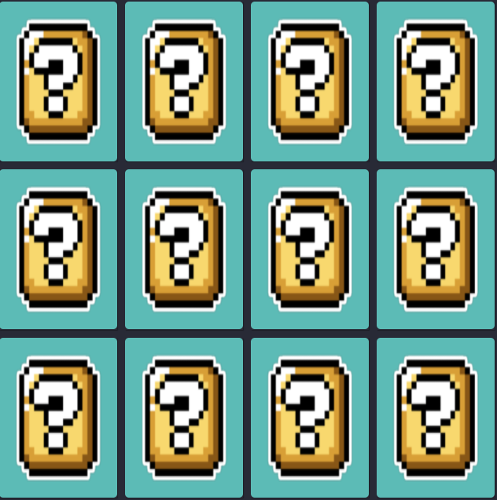
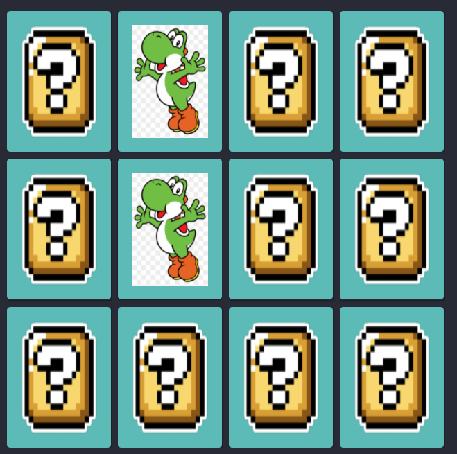

  

<h1 align="center">Desenvolvendo um jogo da memória Digital Innovation One</h1>

Curso do Bootcamp JavaScript Game Developer da [Digital Innovation One](https://digitalinnovation.one/).

Nesse projeto, o desafio será criar um jogo da memória utilizando apenas HTML, CSS e Javascript. Com poucas linhas de código, aprenderemos juntos a trabalhar com efeitos 3D no CSS e lógica de programação utilizando condicionais, Immediately Invoked Function Expression e manipulação de Array em um projeto super divertido.

<h3>👨‍💻 Tecnologias utilizadas</h3>

* [HTML básico](https://www.w3schools.com/html/)
* [CSS básico](https://developer.mozilla.org/pt-BR/docs/Web/CSS)
* [Javascript básico](https://developer.mozilla.org/pt-BR/docs/Web/JavaScript)
 

## 🚀 Let's code! 🚀
